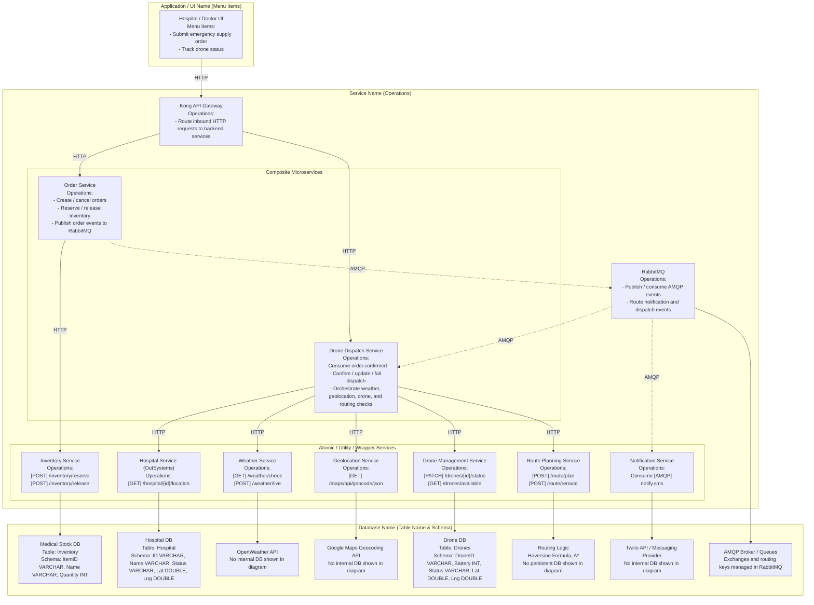
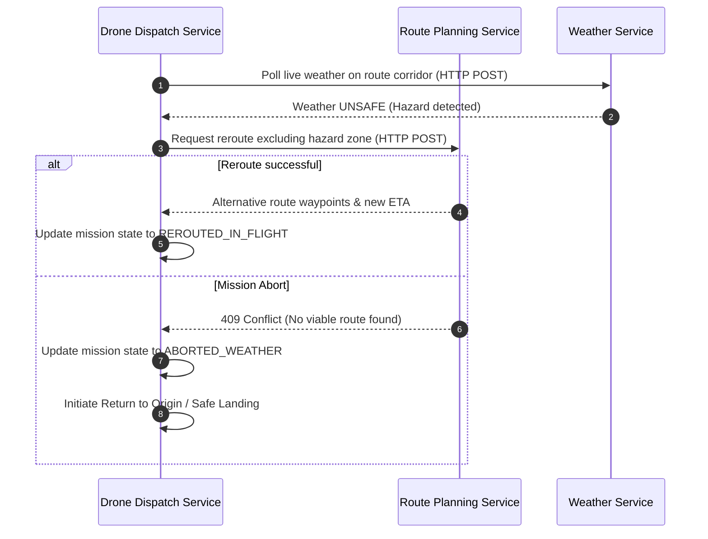
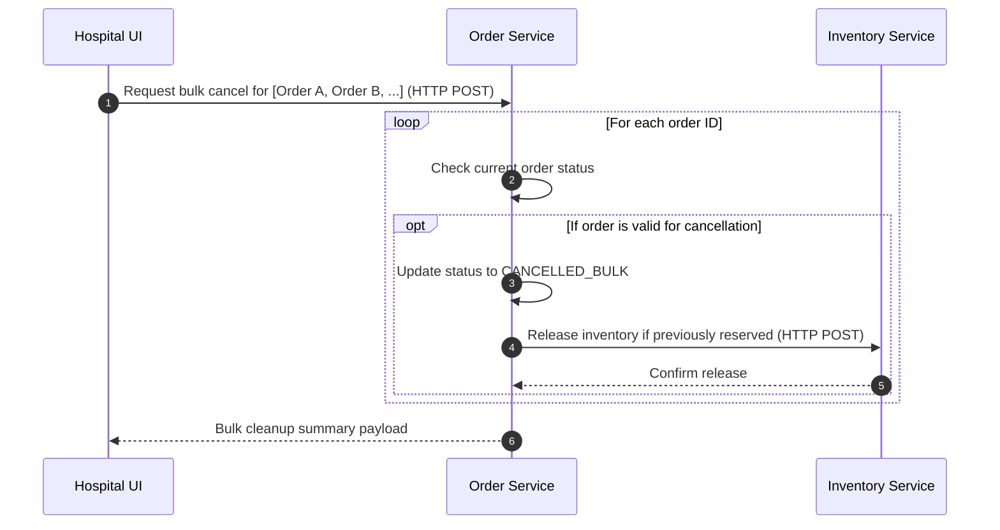

# ESD Project Proposal

> Note: This Markdown version includes only the technical overview diagram, recreated in Mermaid.js.

## Business Context

Business context:
A drone delivery platform catered for hospitals to expedite delivery of emergency critical medical supplies (e.g: blood bags, defibs, organs) to remote clinics/hospitals or accident sites.

Pain Point:
Traffic congestion and inaccessibility to remote sites make delivery slower and harder to be carried out.

Services:
1. Order Service (Orchestrator)
- Technology: Python, Flask, MySQL, Docker.
- Usage: Acts as the central brain. It receives the initial delivery request from the frontend and coordinates the verification, inventory reservation, and drone dispatch.
- Fulfills Requirements: Acts as the orchestrator for Scenario 1 and Scenario 2, fulfilling the requirement for "at least two user scenarios where a (micro)service orchestrates or initiates a choreography".

2. Hospital Service
- Technology: OutSystems.
- Usage: Stores registered hospital profiles and checks if a hospital is valid and operational before a delivery is approved.
- Fulfills Requirements: Explicitly fulfills the strict requirement to "build and expose at least 1 atomic service on Outsystems".

3. Inventory Service
- Technology: Python, Flask, MongoDB, Docker.
- Usage: Manages the stock of medical supplies. It handles locking/reserving items (Scenario 1) and releasing them if a delivery aborts (Scenario 3).
- Fulfills Requirements: Reused across multiple scenarios (it reserves items in Scenario 1, releases them in Scenario 3), fulfilling the rule that "at least one of your microservices should be reused across different user scenarios".

4. Drone Dispatch (composite microservice)
- Technology: Python, Flask, PostgreSQL, Docker.
- Usage: Orchestrates the operational flight workflow. It coordinates with weather, geolocation, and routing services to manage active missions.
- Fulfills Requirements: Initiates an event-driven choreography in Scenario 3, and connects multiple atomic services to fulfill complex business logic.

5. Route Planning Service
- Technology: Python, Flask, PostgreSQL, Docker.
- Usage: Handles flight path computation. It uses the Haversine Formula for distance and A* for rerouting drones around hazardous weather zones.
- Fulfills Requirements: Reused across Scenario 2 (initial planning) and Scenario 3 (rerouting).

6. Weather Service (Wrapper)
- Technology: Python, Flask, PostgreSQL, Docker.
- Usage: Acts as an abstraction layer over the OpenWeatherMap API. Checks destination safety and performs continuous corridor monitoring during flights.
- Fulfills Requirements: Fulfills the "at least one use of an external service" requirement via OpenWeatherMap integration.

7. Drone Management Service
- Technology: Python, Flask, PostgreSQL, Docker.
- Usage: Tracks the physical drone fleet. It monitors battery levels, GPS coordinates, and maintenance status to provide a list of eligible drones for new missions.
- Fulfills Requirements: Maintains its own isolated data entity (Drones), helping fulfill the "minimum of 3 (atomic) microservices for 3 different data entities" rule.

8. Notification Service
- Technology: Node.js (or Python), RabbitMQ, Twilio API, Docker.
- Usage: Listens to the message broker and alerts hospitals via SMS (Twilio) when missions are dispatched, completed, or cancelled.
- Fulfills Requirements: Strictly fulfills the requirement that "your solution must use message-based communication (RabbitMQ) between some microservices."

9. Geolocation Service (Wrapper)
- Technology: Python, Flask, PostgreSQL, Docker.
- Usage: Resolves human-readable addresses into precise latitude/longitude coordinates using the Google Maps Geocoding API, maintaining an internal cache.
- Fulfills Requirements: Fulfills the "at least one use of an external service" requirement via Google Maps integration.

10. API Gateway (Beyond-The-Labs Component)
- Technology: Kong API Gateway.
- Usage: Acts as the single entry point for the frontend UI, handling request routing to backend services.
- Fulfills Requirements: Serves as the "Beyond-The-Labs (BTL) Requirement". Using KONG is explicitly listed as an acceptable BTL implementation.


## Technical Overview Diagram (Mermaid.js)



## Final Scenarios

Scenario 1: Order Lifecycle
This scenario covers the intake and validation of a medical supply order before it is handed
off downstream.
1. Frontend sends an order request to the Order Service.
2. Order Service verifies the hospitals' registration and operational status via the
Hospital Service (Outsystems)
3. If verification passes, Order Service calls Inventory Service to check stock availability
and reserve the requested quantity.
4. If stock is available, Inventory Service reserves the item and returns a confirmation to
Order Service.
5. Order Service marks the order as "Confirmed & Pending Dispatch" and publishes an
order.confirmed event to RabbitMQ for downstream services to act on.
Edge Case - Verification or Stock Failure:
- If hospital verification fails, the order is rejected immediately and no inventory check
is made.
- If stock is unavailable, Inventory Service returns insufficient stock and Order Service
publishes an order-failed event for Notification to inform the hospital accordingly.
Scenario 2: Drone Dispatch (Happy Path)
This scenario focuses on the intelligent selection and assignment of a drone using location
data and a custom routing algorithm.
Happy Path:
1. Drone Dispatch Service consumes the order.confirmed event from RabbitMQ,
containing the delivery destination address and seller hospital address.
2. Drone Dispatch Service calls the Google Maps Geocoding API to resolve the hospital
and customer addresses into precise lat/lng coordinates.
3. Drone Dispatch Service checks weather conditions before committing to any routing
work by calling the Weather Microservice, which internally queries
OpenWeatherMap. If wind speeds at the destination are safe (<= 40 km/h), dispatch
proceeds.
4. Drone Dispatch Service forwards the resolved coordinates and all active drone
locations to the Route Planning Microservice, which applies the Haversine Formula
to calculate straight-line flight distances between each candidate drone, the seller
hospital, and the customer destination.
5. The Route Planning Microservice scores each available drone based on total flight
distance, estimated flight time derived from drone speed and distance, and current
battery level. The optimal drone is selected and its status is updated to "En Route".
6. Route Planning Microservice returns the selected drone, flight path, and ETA to
Drone Dispatch Service, which confirms the assignment back to Order Service.

7. On mission completion, Drone Dispatch Service detects a "Mission Complete" state
and publishes a drone.mission.complete event to RabbitMQ for downstream
Inventory and Notification services to consume.
Scenario 3: Exception Handling and Recovery
This scenario covers various exception handling mechanisms and recovery flows in the system to ensure resilience and data consistency.
- 3.1: Mid-flight weather hazard → Reroute attempt or Mission abort. Demonstrates reacting to live environmental changes during a drone delivery.
- 3.2: Order cancellation with compensating transactions. Demonstrates rolling back state (e.g. freeing up reserved inventory) when an order fails or is aborted.
- 3.3: Bulk order management. Provides a UI cleanup feature allowing admins to cleanly cancel and purge stuck or obsolete orders in bulk.


## Scenario 1: Order Lifecycle

Step 1: Doctor -> Order Service
- Action: Doctor submits a medical supply delivery request.
- Protocol: HTTP POST /order
- JSON Payload:
```json
{ "hospital_id": "HOSP-001", "item_id": "BLOOD-O-NEG", "quantity": 2, "urgency_level":
"CRITICAL" }
```

Step 2: Order Service -> Inventory Service
- Action: Check and reserve the requested medical supplies.
- Protocol: HTTP POST /inventory/reserve
- JSON Payload:
```json
{ "order_id": "ORD-1001", "item_id": "BLOOD-O-NEG", "quantity": 2 }
```
- Response:
```json
{ "status": "RESERVED", "reserved_quantity": 2 }
```
Step 3: Order Service -> RabbitMQ

- Action: Publish a "Order Confirmed & Pending Dispatch" event for downstream
services.
- Protocol: AMQP Publish (Exchange: orders, Routing Key: order.confirmed)
- Payload:
```json
{ "order_id": "ORD-1001", "hospital_id": "HOSP-001", "item_id": "BLOOD-O-NEG",
"urgency_level": "CRITICAL" }
```

Edge Case 1. 2 - Stock Unavailable:
Step 3a: Order Service -> Inventory Service
- Action: Inventory check returns insufficient stock.
- Protocol: HTTP POST /inventory/reserve
- Response:

```json
{ "status": "FAILED", "reason": "INSUFFICIENT_STOCK" }
```
- Internal Action: Order Service publishes an "Order Failed" event to RabbitMQ for
the Notification Service to alert the doctor.


## Scenario 2: Drone Dispatch

Step 1: RabbitMQ -> Drone Dispatch
- Action: Drone Dispatch Service consumes the "Order Confirmed" event from Order
Service.
- Protocol: AMQP Consume (Exchange: orders, Routing Key: order.confirmed)
- Payload:
```json
{ "order_id": "ORD-1001", "hospital_id": "HOSP-001", "customer_address": "10 Medical Ave,
Singapore 168588", "urgency_level": "CRITICAL" }
```

Step 2a: Drone Dispatch -> Hospital Service (hospital DB)
- Action: Retrieve the precise coordinates of hospitals from a local database.
- Protocol:  HTTP GET /hospital/HOSP-001/location
- Params:
```json
{ "hospital_id": "HOSP-001"}
```
- Response:

```json
{ "hospital_coords": { "lat": 1. 2836, "lng": 103. 8333 }, "location_name": "ABC hospital"}
```
Step 2b: Drone Dispatch -> Geolocation Service (Google Maps Geocoding API (with Cache))
- Action: Resolve the customer address into precise lat/lng coordinates for use
in distance calculations. The service will first compute the hash of the address
and query its local geocoding cache. If found, coordinates returned
immediately without external API call (source: CACHE). Otherwise, API called.
Results will be stored in the cache and the coordinates are returned (source:
EXTERNAL_API).
- Protocol: HTTP GET /maps/api/geocode/json
- Params:
```json
{ "address": "10 Medical Ave, Singapore 168588", "key": "API_KEY", "region": "sg" }
```
- Response:

```json
{ "customer_coords": { "lat": 1. 3521, "lng": 103. 8198 }, "source": "EXTERNAL_API",
"formatted_address": "10 Medical Ave, Singapore 168588"  }
```

Step 2c: Internal Payload Assembly
- Action: Collating hospital and customer data with Payload Weight to prepare
for flight.
- Internal Action: Calculate total mission mass (Drone + Battery + Payload)
- Resulting Object:
```json
{"order_id": "ORD-1001", "payload_weight": 1. 2, "hospital_coords": { "lat": 1. 2836, "lng":
103. 8333 }, "customer_coords": { "lat": 1. 3521, "lng": 103. 8198 } }
```
Step 2d: Drone Dispatch Service -> Drone Management Service
- Action: Before committing to route planning or weather checks, verify that the
selected candidate drones have sufficient battery levels and are not flagged as faulty
or under maintenance.
- Protocol: HTTP GET /drones/available
- Params:
```json
{ "region": "CENTRAL", "min_battery_pct": 30 }
```
- Response:
```json
{ "available_drones": [ { "drone_id": "D-04", "battery_pct": 74, "status": "OPERATIONAL" }, {
"drone_id": "D-01", "battery_pct": 81, "status": "OPERATIONAL" } ], "excluded_drones": [ {
"drone_id": "D-02", "battery_pct": 18, "status": "LOW_BATTERY" }, { "drone_id": "D-03",
"battery_pct": 55, "status": "FAULTY" } ] }
```
- Internal Action: Drone Dispatch Service receives the filtered list of operationally
eligible drones and passes only these candidates forward to the weather check and
route planning steps.
Edge Case - No Drones Available:
Step 2d(i): Drone Dispatch Service -> Order Service
- Action: If no drones meet the battery or operational status threshold, Drone Dispatch
Service immediately returns an error to Order Service.
- Protocol: HTTP POST /order/ORD-1001/cancel
- Payload:
```json
{ "status": "CANCELLED", "reason": "NO_DRONES_AVAILABLE" }
```
Step 2d(ii): Order Service -> Inventory Service (Compensating Transaction)
- Action: Release the reserved stock since dispatch cannot proceed.
- Protocol: HTTP POST /inventory/release
- Payload:
```json
{ "order_id": "ORD-1001", "item_id": "BLOOD-O-NEG", "quantity": 2 }
```
- Response:
```json
{ "status": "RELEASED" }
```
Step 2d(iii): Order Service -> RabbitMQ
- Action: Publish a cancellation event for Notification Service to alert the hospital
admin.
- Protocol: AMQP Publish (Exchange: notifications, Routing Key: notify.sms)
- Payload:
```json
{ "hospital_id": "HOSP-001", "message": "Delivery could not be fulfilled. No operational
drones are currently available. Please try again shortly." }
```
Step 3: Drone Dispatch -> Weather Microservice
- Action: Check wind speed at the customer delivery destination before committing
to route planning or drone assignment. If conditions are unsafe, abort
immediately.
- Protocol: HTTP GET /weather/check
- Params:
```json
{ "lat": 1. 3521, "lng": 103. 8198 }
```
- Internal Action: Weather Microservice calls OpenWeatherMap API and evaluates
the result.
- Response:
```json
{ "wind_speed_kmh": 28, "status": "SAFE" }
```
- Internal Action: Wind speed is within safe threshold (<= 40 km/h). Dispatch proceeds.
Step 4: Drone Dispatch -> Route Planning Microservice
- Action: Pass the resolved coordinates and all active drone locations to the
Route Planning Microservice to determine which drone to assign and calculate
the optimal flight path.
- Protocol: HTTP POST /route/plan
- Payload:
```json
{ "hospital_coords": { "lat": 1. 2836, "lng": 103. 8333 }, "customer_coords": { "lat": 1. 3521,
"lng": 103. 8198 }, "payload_weight": 1. 2, "available_drones": [ { "drone_id": "D-01", "coords":
{ "lat": 1. 2900, "lng": 103. 8400 }, "battery": 81 }, { "drone_id": "D-04", "coords": { "lat": 1. 2850,
"lng": 103. 8350 }, "battery": 74 } ] }
```
Step 5: Route Planning Microservice - Internal Algorithm (Drone Selection)
- Action: Apply the Haversine Formula to calculate straight-line distances from
each drone to the hospital and from the hospital to the customer. Calculate the
estimate energy required based on base weight, payload weight and wind
resistance. Score all candidates based on total flight distance, estimated flight
time, and battery level, using the score (remaining_battery /
total_mission_time)
- Internal Action: Algorithm ranks all candidates and selects the optimal drone.
- Result:
```json
{ "selected_drone": "D-04", "score": 94. 7, "calculation_data":{ "estimated_energy_use":
142. 5, "estimated_energy_available": 259. 0,   "reason": "Shortest total flight path, sufficient
battery, lowest ETA", "flight_path": { "drone_to_hospital_km": 0. 6,
"hospital_to_customer_km": 7. 8, "total_km": 8. 4, "eta_minutes": 14 } } }
```
Step 6: Route Planning Microservice -> Drone Dispatch
- Action: Return the selected drone, full flight path, and ETA to Drone Dispatch
Service.
- Protocol: HTTP 200 Response to /route/plan
- Response:
```json
{ "order_id": "ORD-1001", "drone_id": "D-04", "eta_minutes": 14, "status":
"ROUTE_CONFIRMED" }
```
Step 7: Drone Dispatch -> Order Service
- Action: Return confirmed drone assignment and ETA to Order Service.
- Protocol: HTTP POST /dispatch/confirm
- Response:
```json
{ "order_id": "ORD-1001", "drone_id": "D-04", "eta_minutes": 14, "status": "DISPATCHED" }
```


## Scenario 3: Exception Handling and Recovery

This scenario outlines how the system handles exceptional states, demonstrating robust error recovery, compensating transactions to maintain consistency, and operational cleanup features.

### Scenario 3.1: Mid-flight weather hazard → Reroute attempt or Mission abort

**Overview:**
While a drone is actively in flight, the Drone Dispatch Service continuously monitors the weather along its corridor. If hazardous conditions (e.g., thunderstorms or high winds) are detected via the Weather Service, it consults the Route Planning Service to find a safe alternative path. If one is found, the drone reroutes. 

**Microservice Interaction Diagram:**


Step 1: Drone Dispatch -> Weather Service
- Action: Drone Dispatch Service polls the Weather Microservice for live safety status along the drone's current corridor (current -> destination)
- Protocol: HTTP POST /weather/live
- Payload:
```json
{
  "order_id": "ORD-1001",
  "drone_id": "D-04",
  "current_coords": { "lat": 1.3005, "lng": 103.8375 },
  "destination_coords": { "lat": 1.3521, "lng": 103.8198 }
}
```

Step 2: Weather Service -> OpenWeatherMap API
- Action: Weather Service retrieves live weather data for sampled points along the current flight corridor.
- Protocol: HTTPS GET https://api.openweathermap.org/data/2.5/weather
- Sample Response:
```json
{
  "weather": [{ "main": "Thunderstorm", "description": "thunderstorm with heavy rain" }],
  "wind": { "speed": 12.8 },
  "rain": { "1h": 18.4 }
}
```

Step 3: Weather Service -> Drone Dispatch Service
- Action: Weather Service evaluates the weather data and returns an unsafe corridor result with hazard details.
- Protocol: HTTP 200 Response
- Response:
```json
{
  "status": "UNSAFE",
  "reason": ["HIGH_WIND", "HEAVY_RAIN", "THUNDERSTORM"],
  "wind_kmh": 46.1,
  "hazard_zone": { "center": { "lat": 1.3263, "lng": 103.8286 }, "radius_km": 2.0 },
  "recommended_action": "REROUTE"
}
```

Step 4: Drone Dispatch Service -> Route Planning Service
- Action: Drone Dispatch requests a new flight path that avoids the detected hazard zone.
- Protocol: HTTP POST /route/reroute
- Payload:
```json
{
  "order_id": "ORD-1001",
  "drone_id": "D-04",
  "current_coords": { "lat": 1.3005, "lng": 103.8375 },
  "destination_coords": { "lat": 1.3521, "lng": 103.8198 },
  "hazard_zone": { "center": { "lat": 1.3263, "lng": 103.8286 }, "radius_km": 2.0 },
  "avoid_conditions": ["HIGH_WIND", "HEAVY_RAIN", "THUNDERSTORM"],
  "max_detour_minutes": 10
}
```

Step 5: Route Planning Service (Internal Logic)
- Action: Recalculates the path using A* pathfinding while excluding the hazardous weather zone.
- Internal Result: A valid alternative route is found.

Step 6: Route Planning Service -> Drone Dispatch Service
- Action: Returns a safe rerouted path with updated waypoints and ETA.
- Protocol: HTTP 200 Response
- Response:
```json
{
  "status": "REROUTE_FOUND",
  "route_id": "RT-204",
  "waypoints": [
    { "lat": 1.3088, "lng": 103.8360 },
    { "lat": 1.3201, "lng": 103.8331 },
    { "lat": 1.3384, "lng": 103.8267 },
    { "lat": 1.3521, "lng": 103.8198 }
  ],
  "updated_eta": "2026-03-12T15:27:00+08:00",
  "distance_km": 7.4
}
```

Step 7: Drone Dispatch Service (Internal Update)
- Action: Updates the active mission with the new route and sets the dispatch status to `REROUTED_IN_FLIGHT`.

Step 8: Drone Dispatch Service -> Order Service
- Action: Notifies Order Service that delivery is still continuing, but on a new rerouted path.
- Protocol: HTTP POST /dispatch/update
- Payload:
```json
{
  "order_id": "ORD-1001",
  "drone_id": "D-04",
  "dispatch_status": "REROUTED_IN_FLIGHT",
  "route_id": "RT-204",
  "updated_eta": "2026-03-12T15:27:00+08:00"
}
```
- Response:
```json
{
  "message": "Dispatch update recorded successfully",
  "order_id": "ORD-1001",
  "order_status": "IN_TRANSIT",
  "dispatch_status": "REROUTED_IN_FLIGHT"
}
```


### Scenario 3.2: Order cancellation with compensating transactions

**Overview:**
Following a mission abort (such as no viable reroute being found) or an upfront dispatch failure, the Order Service executes a compensating transaction by calling the Inventory Service to release reserved supplies. It then publishes a cancellation event for the Notification Service.

**Microservice Interaction Diagram:**


```mermaid
sequenceDiagram
    autonumber
    participant DD as Drone Dispatch Service
    participant OS as Order Service
    participant INV as Inventory Service
    participant RMQ as RabbitMQ
    participant NOT as Notification Service

    DD->>OS: Report delivery failure / aborted (HTTP POST)
    OS-->>DD: Acknowledge failure report
    OS->>OS: Update order status to CANCELLED
    
    rect rgb(60, 60, 80)
        Note over OS,INV: Compensating Transaction
        OS->>INV: Release reserved inventory (HTTP POST /release)
        INV-->>OS: Inventory released successfully
    end

    OS->>RMQ: Publish ORDER_CANCELLED event (AMQP)
    RMQ-->>OS: Event queued
    RMQ->>NOT: Deliver event
    NOT-->>RMQ: Acknowledge event
    NOT->>NOT: Send SMS/Email alert to Hospital via Twilio
```

Step 1: Drone Dispatch Service -> Order Service
- Action: Drone Dispatch reports that delivery has failed due to unsafe weather and no viable reroute.
- Protocol: HTTP POST /dispatch/failure
- Payload:
```json
{
  "order_id": "ORD-1001",
  "drone_id": "D-04",
  "failure_code": "WEATHER_NO_ROUTE",
  "dispatch_status": "ABORTED_WEATHER",
  "recovery_action": "RETURN_TO_ORIGIN"
}
```
- Response:
```json
{
  "order_id": "ORD-1001",
  "drone_id": "D-04",
  "status": "CANCELLED_WEATHER",
  "reason": "NO_VIABLE_ROUTE_WEATHER"
}
```

Step 2: Order Service (Internal Logic)
- Action: Updates the order status to `CANCELLED_WEATHER` and prepares compensating actions.

Step 3: Order Service -> Inventory Service
- Action: Order Service releases the previously reserved stock.
- Protocol: HTTP POST /inventory/release
- Payload:
```json
{
  "order_id": "ORD-1001",
  "items": [
    { "item_id": "BLD-O-NEG-001", "reserved_quantity": 2 }
  ]
}
```
- Response:
```json
{
  "status": "RELEASED",
  "order_id": "ORD-1001"
}
```

Step 4: Order Service -> RabbitMQ
- Action: Publishes a cancellation event for downstream notification handling.
- Protocol: AMQP Publish (Exchange: notifications, Routing Key: notify.sms)
- Payload:
```json
{
  "event_type": "ORDER_CANCELLED_WEATHER",
  "order_id": "ORD-1001",
  "hospital_id": "HSP-001",
  "message": "URGENT: Delivery cancelled mid-flight due to severe weather. Drone returning to base. Reserved stock has been released."
}
```

Step 5: Notification Service <- RabbitMQ
- Action: Consumes the weather cancellation event.
- Protocol: AMQP Consume from notifications exchange.

Step 6: Notification Service -> Twilio API
- Action: Sends an SMS alert to the hospital contact.
- Protocol: HTTPS POST https://api.twilio.com/2010-04-01/Accounts/{AccountSid}/Messages.json
- Payload:
```json
{
  "To": "+65123456787",
  "From": "+6598765432",
  "Body": "Medi-Drone Update: Order ORD-1001 was cancelled due to unsafe weather. Reserved stock has been released."
}
```
- Response:
```json
{
  "sid": "SMXXXXXXXXXXXXXXXXXXXXXXXXXXXXXXXX",
  "status": "queued"
}
```

### Scenario 3.3: Bulk order management (UI cleanup feature)

**Overview:**
To handle system load or administrative operations, the frontend provides a bulk cleanup feature where a hospital admin can select multiple stale or stuck orders to cancel at once. The UI invokes the Order Service, which acts as an orchestrator to sequentially or concurrently cancel the orders, ensuring that any associated inventory is correctly released.

**Microservice Interaction Diagram:**


Step 1: Hospital UI -> Order Service
- Action: Admin selects multiple orders and triggers a bulk cancel operation.
- Protocol: HTTP POST /orders/bulk-cancel
- Payload:
```json
{
  "admin_id": "ADM-099",
  "order_ids": ["ORD-1001", "ORD-1002", "ORD-1005"],
  "reason": "STALE_ORDER_CLEANUP"
}
```

Step 2: Order Service (Internal Loop & Verification)
- Action: Iteratively or concurrently releases inventory for each successfully cancelled order.
- Protocol: HTTP POST /inventory/release
- Payload (Example for ORD-1001):
```json
{
  "order_id": "ORD-1001",
  "items": [{ "item_id": "BLD-O-NEG-001", "reserved_quantity": 2 }]
}
```
- Response:
```json
{
  "status": "RELEASED",
  "order_id": "ORD-1001"
}
```

Step 3: Order Service -> Hospital UI
- Action: Aggregates the results and returns a summary payload.
- Protocol: HTTP 200 Response
- Response:
```json
{
  "status": "SUCCESS",
  "total_processed": 3,
  "successful_cancels": 2,
  "failed_cancels": 1,
  "details": [
    { "order_id": "ORD-1001", "status": "CANCELLED_BULK", "inventory_released": true },
    { "order_id": "ORD-1002", "status": "CANCELLED_BULK", "inventory_released": true },
    { "order_id": "ORD-1005", "status": "FAILED", "reason": "ORDER_ALREADY_DELIVERED" }
  ]
}
```
